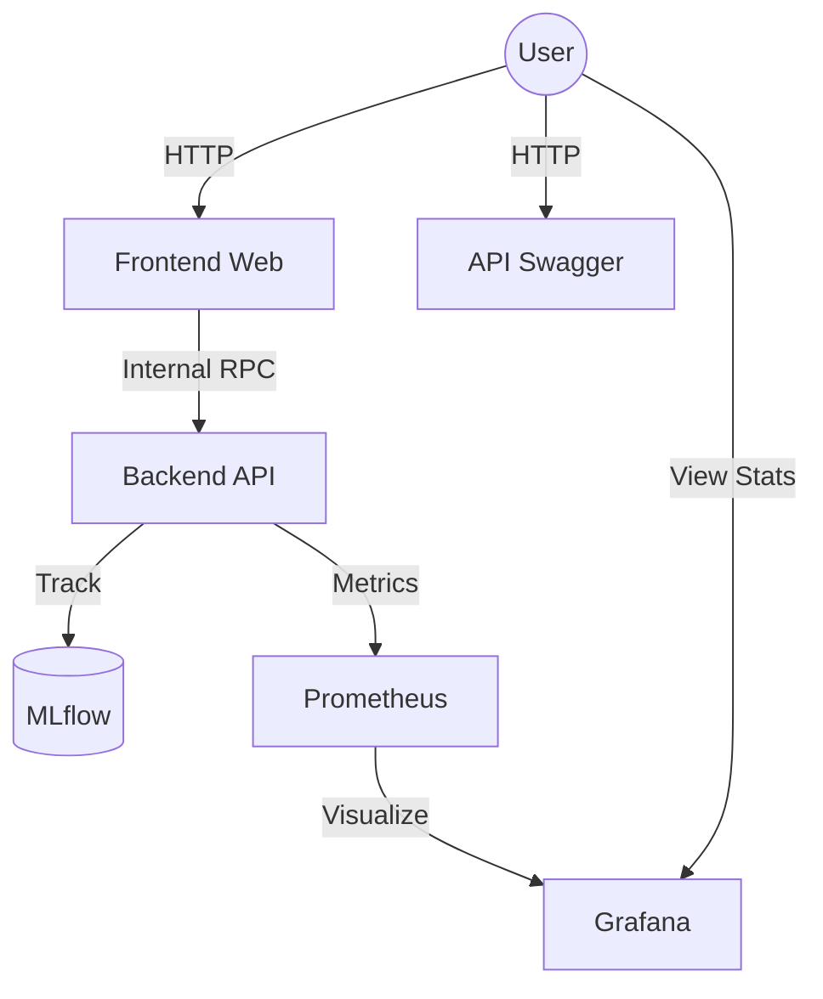

# Heart Disease Prediction: End-to-End MLOps Solution

[](https://github.com/2024ab05112/heart-disease-app/actions)
[](https://opensource.org/licenses/MIT)

A production-ready machine learning system for heart disease risk prediction, featuring automated CI/CD, experiment tracking with MLflow, and scalable deployment on Azure Kubernetes Service (AKS).

## Live Access
Each component is accessible via its own dedicated FQDN:
- **Web Application:** [Frontend UI](http://heart-disease-2024ab05112.centralindia.cloudapp.azure.com/)
- **API Documentation:** [Swagger UI](http://heart-disease-api-2024ab05112.centralindia.cloudapp.azure.com/api/docs)
- **Monitoring:** [Grafana Dashboard](http://heart-disease-grafana-2024ab05112.centralindia.cloudapp.azure.com/) | [Prometheus UI](http://heart-disease-prom-2024ab05112.centralindia.cloudapp.azure.com/)

---

## Professional Documentation
For comprehensive details on EDA, modelling choices, experiment tracking, and pipeline design, please refer to the official project reports:
- [**Project Report**](docs/Project_Report.docx) ([Markdown Version](docs/Project_Report.md))
- [**Technical Overview**](docs/Detailed_Project_Report.docx) ([Markdown Version](docs/Detailed_Project_Report.md))
- [**Project Detail Description**](https://drive.google.com/file/d/1EAkUQg3R94hodZxZxqRHMX2v1R3LgmU4/view)

---

## System Architecture
The system utilizes a decentralized microservices architecture orchestrated by Kubernetes (AKS). Each service is exposed via an independent Azure Load Balancer.



---

## Quick Start (Local Setup)

The easiest way to run the entire stack locally is via **Docker Compose**. This will build all images from scratch and orchestrate the services.

### 1. Prerequisites
- Docker & Docker Compose installed.
- Repository cloned.

### 2. Execution
```bash
# Build and start all services (Backend, Frontend, MLflow)
docker-compose up --build
```
The application will be available at `http://localhost`.

---

## CI/CD Workflow
The project follows a robust automation lifecycle via GitHub Actions:
1. **Linting & Testing:** Automated checks using `flake8` and `pytest`.
2. **Containerization:** Concurrent Docker builds for high efficiency.
3. **Deployment:** Automated rollout to Azure Kubernetes Service on every push to `main`.

---
*Developed as part of the MLOps Assignment*