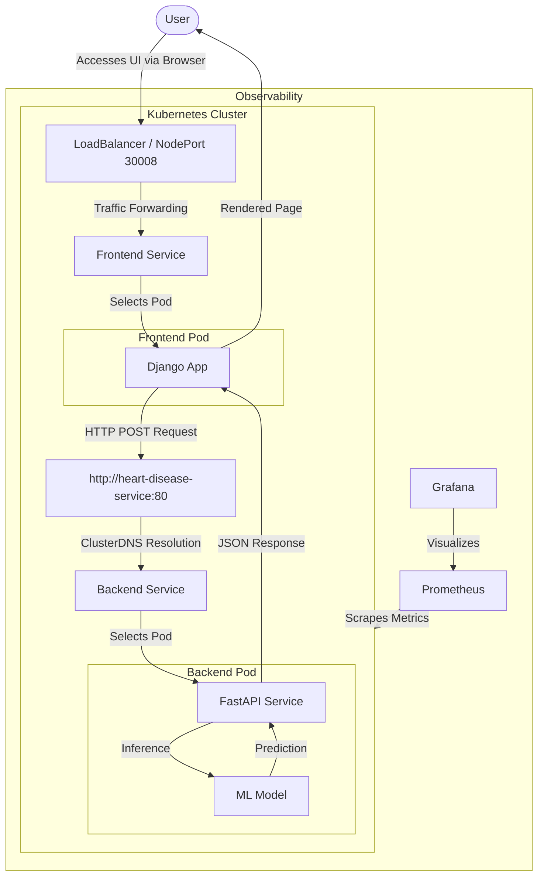

# Service Architecture & Workflow

This document details the architecture and request flow of the Heart Disease Prediction System.

## Architecture Diagram

The following Mermaid diagram illustrates how the different components interact within the Kubernetes cluster.

## Service Communication Details

### 1. User -> Frontend
- **Service**: `heart-disease-frontend-service`
- **Type**: LoadBalancer (or NodePort in Minikube)
- **External Port**: 30008
- **Flow**: The user accesses the application URL. The Service routes the request to a `heart-disease-frontend` pod running the Django application.

### 2. Frontend -> Backend
- **Service**: `heart-disease-service`
- **Type**: NodePort (ClusterIP component used for internal comms)
- **Internal DNS**: `heart-disease-service`
- **Internal Port**: 80
- **Flow**:
    - When a user submits the form, the Django view sends a synchronous HTTP POST request to `http://heart-disease-service:80/predict`.
    - Kubernetes CoreDNS resolves `heart-disease-service` to the ClusterIP of the backend service.
    - The request is routed to a `heart-disease-api` pod.

### 3. Backend Execution
- The FastAPI application receives the request payload.
- It loads the pre-trained model (if not already loaded).
- It performs inference and returns the result (e.g., "Heart Disease Detected" or "Normal") as a JSON response.

### 4. Response
- The Django frontend parses the JSON response.
- It renders the result template and sends the HTML back to the user's browser.
