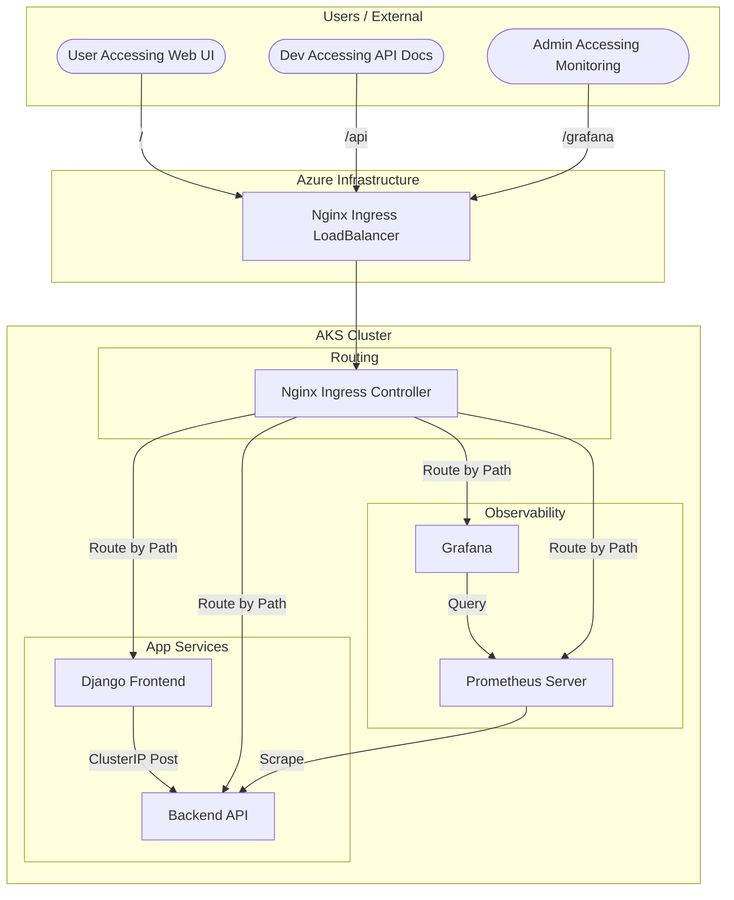

# Service Architecture & Workflow

This document details the architecture and request flow of the Heart Disease Prediction System.

## Architecture Diagram

The system is optimized for cloud resources by using a single **Public IP Address** coupled with path-based routing via an Nginx Ingress Controller.

## Service Communication Details

### 1. Unified Access (Ingress)
All components are accessible via a single FQDN:
`http://heart-disease-2024ab05112.centralindia.cloudapp.azure.com/`

- **Frontend:** `/`
- **Backend API:** `/api/`
- **Grafana:** `/grafana/`
- **Prometheus:** `/prometheus/`

This setup is highly cost-efficient as it requires only **one Public IP** from Azure.

### 2. Implementation Logic
- **Nginx Ingress** manages the `X-Forwarded-Host` and `X-Forwarded-For` headers automatically.
- **Django** is no longer acting as a proxy. It is purely a consumer of the backend API.
- **Grafana** is configured with `serve_from_sub_path: true` to handle the `/grafana/` prefix.

### 3. Frontend -> Backend (Internal)
- **Flow**:
    - When a user submits the form, Django sends a request to `http://heart-disease-service:80/api/predict`.
    - This is purely internal ClusterIP traffic, meaning it never leaves the AKS network, ensuring high security and zero latency cost.
