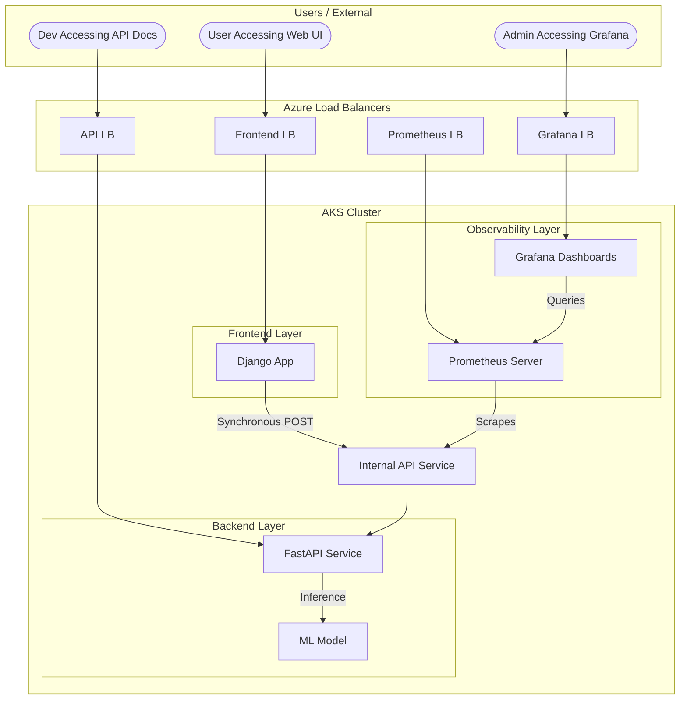

# Service Architecture & Workflow

This document details the architecture and request flow of the Heart Disease Prediction System.

## Architecture Diagram

The following Mermaid diagram illustrates how the different components interact within the Kubernetes cluster using dedicated Load Balancers.

## Service Communication Details

### 1. External Access Points
Each service is reachable via a unique Azure DNS label under the `centralindia.cloudapp.azure.com` domain.

- **Frontend:** `heart-disease-2024ab05112`
- **Backend API:** `heart-disease-api-2024ab05112`
- **Grafana:** `heart-disease-grafana-2024ab05112`
- **Prometheus:** `heart-disease-prom-2024ab05112`

### 2. Frontend -> Backend (Internal)
- **Service**: `heart-disease-service`
- **Type**: LoadBalancer (Internal IP)
- **Internal DNS**: `heart-disease-service`
- **Flow**:
    - When a user submits the form, the Django view sends a synchronous HTTP POST request to `http://heart-disease-service:80/api/predict`.
    - This communication stays **inside** the cluster network for maximum performance and security.

### 3. Backend Execution
- The FastAPI application receives the request payload.
- It loads the pre-trained model and performs inference.
- Results are returned as JSON, which Django then renders for the user.

### 4. Monitoring Flow
- **Prometheus** scrapes metrics directly from the backend service at `http://heart-disease-service:80/api/metrics`.
- **Grafana** is configured with an internal datasource pointing to `http://prometheus:9090`.
- Users can access the Grafana UI directly to view the "Heart Disease API Health" dashboard without passing through the Django frontend.
