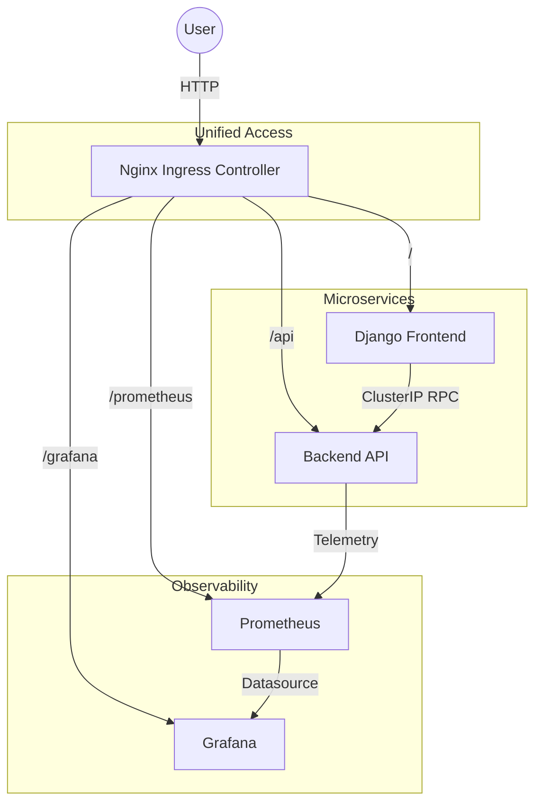

# Comprehensive MLOps Project Documentation
## Heart Disease Prediction System

**Author:** 2024ab05112  
**Date:** January 06, 2026  
**Project Role:** MLOps Engineer / Full Stack Developer  

---

## **1. Introduction**

### **1.1. Project Overview**
The **Heart Disease Prediction System** is an end-to-end Machine Learning Operations (MLOps) project designed to predict the likelihood of heart disease in patients based on clinical parameters. 

This project demonstrates a **production-grade architecture** where the model is served as a scalable microservice, consumed by a user-friendly web interface, and orchestrated using **Kubernetes (AKS)** on **Azure Cloud** via an **Ingress-managed gateway**.

### **1.2. Key Objectives**
- **Automated Deployment**: Full CI/CD pipeline including Ingress and DNS automation.
- **Unified Gateway**: Single entry point for all services (Web, API, Monitoring) using Nginx Ingress.
- **Cost Optimization**: Minimized Public IP usage (1 IP) and on-demand cluster management.
- **Observability**: Real-time tracking via Prometheus and Grafana.

---

## **2. Dataset and Modeling**

### **2.1. Dataset Description**
The project uses the "Heart Disease UCI" dataset, containing 13 clinical features such as age, chest pain type, and cholesterol levels to predict heart disease presence.

### **2.2. Model Training & Evaluation**
- **Algorithm**: Random Forest Classifier (selected for high accuracy).
- **Experiment Tracking**: Integrated with **MLflow** to log parameters, metrics, and versioned artifacts.
- **Deployment**: The model is packaged into a FastAPI container as a serialized artifact.

---

## **3. Application Architecture**

The system follows a microservices pattern routed through a centralized Nginx Ingress Controller.

### **3.1. Architecture Diagram**

---

## **4. Infrastructure & Deployment**

### **4.1. Azure Kubernetes Service (AKS)**
The application is hosted on AKS, leveraging:
- **Nginx Ingress**: Provides path-based routing and SSL termination capabilities.
- **Dynamic DNS**: Automated Azure CLI logic to link the cluster's Public IP to a human-readable domain.

### **4.2. Unified FQDN Access**
All components are available through a single stable URL:
`http://heart-disease-2024ab05112.centralindia.cloudapp.azure.com`

---

## **5. CI/CD Pipeline (GitHub Actions)**

The project utilizes a fully automated DevOps workflow defined in `.github/workflows/deploy.yml`.

### **5.1. Pipeline Capabilities**
- **Smart Builds**: Concurrent Docker builds triggered only on directory changes.
- **Auto-Provisioning**: Automatically starts the AKS cluster if it is in a "Stopped" state.
- **Controller Management**: Installs the Nginx Ingress Controller automatically during the deployment phase.
- **DNS Sync**: Dynamically updates the Azure Public IP with the assigned DNS label.

---

## **6. Monitoring & Observability**

### **6.1. Metrics & Dashboards**
- **Prometheus**: Scrapes metrics from the `/api/metrics` endpoint of the FastAPI backend.
- **Grafana**: Visualizes KPIs such as API Latency, Request Per Second, and Model Confidence Scores.
- **Access Paths**: Monitoring tools are secured and exposed at `/prometheus` and `/grafana` sub-paths.

---

## **7. Testing & Validation**

Verification of the system can be performed through the following steps:
1. **GitHub Actions**: Ensure the deployment pipeline shows a success status for all stages.
2. **Unified URL**: Access the main landing page and verify the prediction form is functional.
3. **API Integrity**: Check `/api/docs` to test the backend logic directly via Swagger UI.
4. **Monitoring Health**: Access `/grafana/` to view real-time system telemetry.

---
**End of Documentation**
