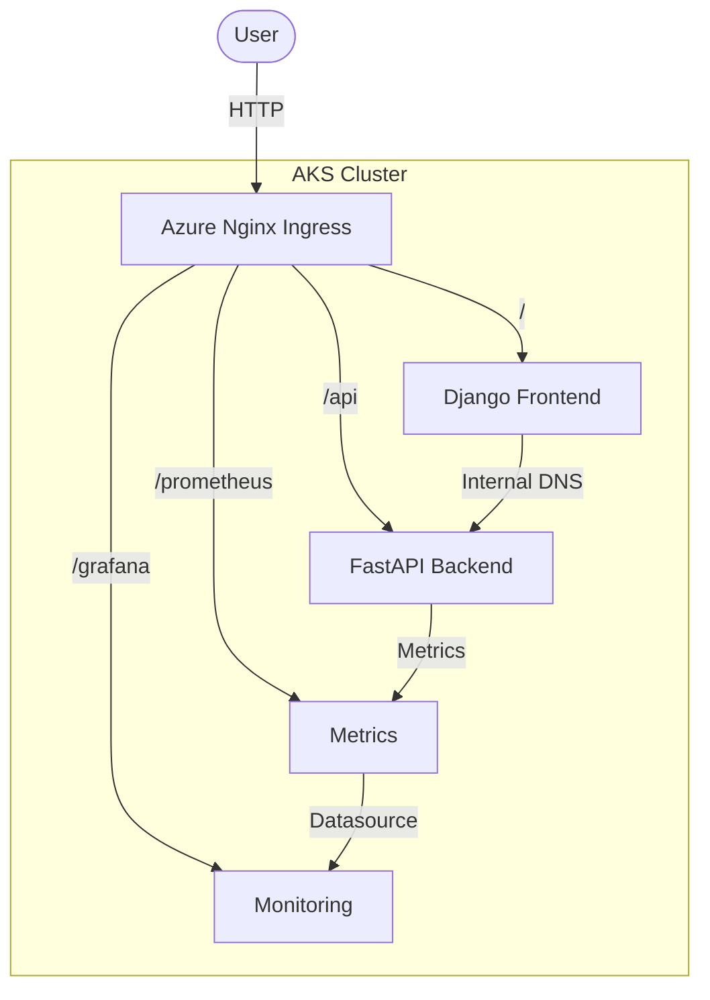

# MLOps Project Report: Heart Disease Prediction System

**Date:** January 06, 2026
**Author:** 2024ab05112
**Project:** End-to-End MLOps Pipeline on Azure AKS

---

## **1. Executive Summary**

This document details the architecture, deployment, and verification procedures for the **Heart Disease Prediction System**. The project implements a robust MLOps pipeline that serves a Machine Learning model via a **FastAPI** backend and a **Django** frontend.

The system is deployed on **Azure Kubernetes Service (AKS)** using an automated **Nginx Ingress Controller** based architecture. This setup optimizes Azure resource usage (1 Public IP) and provides a unified, professional entry point for users, developers, and administrators.

---

## **2. System Architecture**

### **Unified Gateway Design**

The application uses an Ingress-based architecture to manage multiple microservices. All services are exposed through a single Azure Public IP with a stable DNS label.

### **Architecture Diagram**

### **Service Roles**

1.  **Frontend (Django)**: Web UI for prediction inputs.
2.  **Backend (FastAPI)**: Standardized API for model inference and Prometheus metrics exposure.
3.  **Monitoring (Grafana/Prometheus)**: System observability stack.

---

## **3. CI/CD Pipeline Architecture**

The project uses **GitHub Actions** (`.github/workflows/deploy.yml`) to automate the entire lifecycle.

### **Pipeline Workflow**

1.  **Change Detection**: Rebuilds Docker images only if relevant source code has changed.
2.  **Build & Push**: Tags images with Commit SHA and pushes to Docker Hub.
3.  **Auto-Infrastructure**: 
    - Automatically **Starts** the AKS cluster if it is stopped.
    - Automatically **Installs** Nginx Ingress Controller if missing.
    - Automatically **Links** the Azure DNS label to the new Ingress Public IP.
4.  **Deployment**: Updates manifests with new image SHAs and applies changes to AKS.

---

## **4. Service Exposure (Unified FQDN)**

All external access is consolidated under a single domain:
**Base URL**: `http://heart-disease-2024ab05112.centralindia.cloudapp.azure.com`

- **Frontend**: `/`
- **Backend Swagger**: `/api/docs`
- **Grafana**: `/grafana/`
- **Prometheus**: `/prometheus/`

---

## **5. Testing & Verification Guide**

### **Step 1: Automated Deployment**
Check the **Actions** tab in GitHub. A successful run confirms:
- Source code linting passed.
- Unit tests passed.
- Docker images built and pushed.
- K8s deployment successful.

### **Step 2: Access Validation**
1. Open the Base URL in a browser.
2. Verify the Form loads (Frontend).
3. Append `/api/docs` to verify API accessibility.
4. Append `/grafana/` to check monitoring status.

---
**End of Detailed Report**
