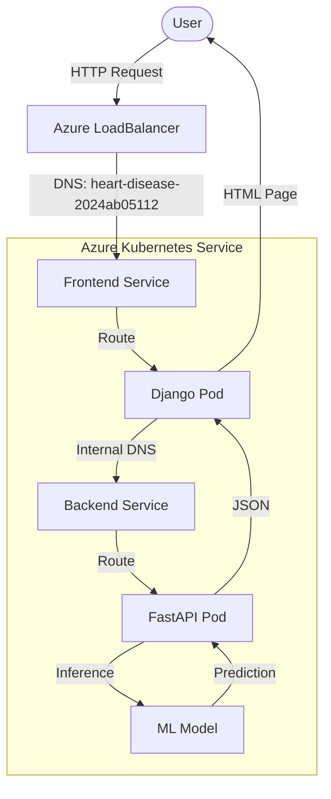

# MLOps Project Report: Heart Disease Prediction System

**Date:** December 29, 2024  
**Author:** 2024ab05112  
**Project:** End-to-End MLOps Pipeline on Azure AKS

---

## **Table of Contents**

1.  **Executive Summary**
2.  **System Architecture**
    *   High-Level Overview
    *   Microservices Design
    *   Request Flow
3.  **CI/CD Pipeline Architecture**
    *   Workflow Strategy
    *   Automation Logic
4.  **Deployment & Infrastructure**
    *   Azure Kubernetes Service (AKS)
    *   Service Exposure (Public FQDN)
5.  **Testing & Verification Guide**
    *   Step 1: Code Push & Pipeline Trigger
    *   Step 2: Deployment Verification
    *   Step 3: Public FQDN Validation

---

## **1. Executive Summary**

This document details the architecture, deployment, and verification procedures for the **Heart Disease Prediction System**. The project implements a robust MLOps pipeline that serves a Machine Learning model via a **FastAPI** backend and a **Django** frontend.

The system is deployed on **Azure Kubernetes Service (AKS)** using a fully automated **CI/CD pipeline** via GitHub Actions. Key features include "Smart Builds" to optimize resource usage, automatic cluster management for cost efficiency, and dynamic versioning for reliable rollbacks.

---

## **2. System Architecture**

### **High-Level Overview**

The application is composed of two primary microservices running as containerized pods within a Kubernetes cluster:

*   **Frontend**: A Django-based web interface that accepts user input (patient health data).
*   **Backend**: A FastAPI service that loads a Scikit-Learn model to perform real-time inference.

### **Architecture Diagram**



### **Microservices Design**

1.  **Frontend (Django)**:
    *   **Role**: User Interface & Orchestrator.
    *   **Exposure**: Exposed to the public internet via a `LoadBalancer` service type.
    *   **Configuration**: Assigned a stable Azure DNS label (`heart-disease-2024ab05112`).
2.  **Backend (FastAPI)**:
    *   **Role**: Model Serving API.
    *   **Exposure**: Internal ClusterIP only (not accessible from internet).
    *   **Logic**: Validates input data, loads `model.pkl`, and returns classification results + confidence scores.

---

## **3. CI/CD Pipeline Architecture**

The project uses **GitHub Actions** (`.github/workflows/deploy.yml`) to orchestrate the lifecycle from code commit to production deployment.

### **Pipeline Workflow**

1.  **Trigger**: The pipeline starts automatically on a `push` to the `main` branch.
2.  **Change Detection (Smart Build)**:
    *   A job checks which folders (`backend/`, `frontend/`, `k8s/`) were modified.
    *   Docker images are rebuilt **only** if their respective source code has changed.
3.  **Build & Push**:
    *   Images are built and tagged with the specific **Commit SHA** (e.g., `api:a1b2c3d`).
    *   This ensures exact traceability between running code and source commit.
4.  **Cluster Management**:
    *   The pipeline checks the status of the AKS cluster (`HeartDiseaseCluster`).
    *   If the cluster is **Stopped** (to save costs), the pipeline sends an instruction to **Start** it before proceeding.
5.  **Deployment**:
    *   The Kubernetes manifests are dynamically patched to use the new Docker image tags.
    *   `kubectl apply` updates the resources in the cluster with zero downtime (rolling update).

---

## **4. Deployment & Infrastructure**

### **Azure Configuration**

*   **Resource Group**: `HeartDiseaseRG`
*   **Cluster Name**: `HeartDiseaseCluster`
*   **Region**: East US (or configured region)

### **Service Exposure (Public FQDN)**

The frontend service is configured as a `LoadBalancer` with a specific Azure annotation:

```yaml
metadata:
  annotations:
    service.beta.kubernetes.io/azure-dns-label-name: heart-disease-2024ab05112
spec:
  type: LoadBalancer
```

This configuration automatically provisions a public DNS name for the application:
**URL**: `http://heart-disease-2024ab05112.<region>.cloudapp.azure.com`

*(Note: Replace `<region>` with the actual Azure region of the cluster, e.g., `eastus`)*

---

## **5. Testing & Verification Guide**

To validate the complete flow, follow this testing procedure.

### **Step 1: Test the CI/CD Pipeline**

1.  Make a small change to the code (e.g., update a text in `frontend/templates/index.html` or `README.md`).
2.  Commit and push the change:
    ```bash
    git add .
    git commit -m "Test: Trigger deployment pipeline"
    git push origin main
    ```
3.  Go to the **Actions** tab in the GitHub Repository.
4.  Observe the workflow `Build and Deploy to AKS`.
    *   **Success Criteria**: All steps (Check Changes, Build, Start Cluster, Deploy) should turn **Green**.

### **Step 2: Validate Service Status**

Once the pipeline completes, verify the service is up on Azure.

*If you have CLI access:*
```bash
kubectl get svc heart-disease-frontend-service
```
*Expected Output:*
*   **EXTERNAL-IP**: A public IP address (e.g., `20.42.xx.xx`).
*   **PORT(S)**: `80:30008/TCP`.

### **Step 3: Public FQDN Validation**

1.  Construct your URL: `http://heart-disease-2024ab05112.eastus.cloudapp.azure.com` (assuming `eastus`).
2.  Open the URL in a web browser.
3.  **Success Criteria**: The Heart Disease Prediction home page loads.

### **Step 4: Functional Testing**

1.  Fill in the form with sample data:
    *   *Age*: 50, *Sex*: 1, *CP*: 0, *Trestbps*: 130, *Chol*: 250...
2.  Click **Predict**.
3.  **Success Criteria**: The page reloads and displays a result (e.g., "Prediction: Heart Disease Detected").

---
**End of Report**
