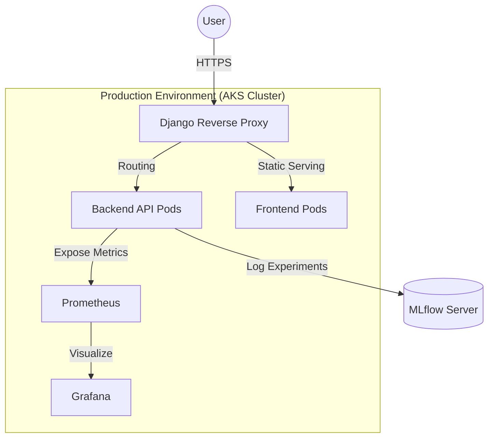

# Heart Disease Prediction: MLOps End-to-End Implementation Report

## 1. Project Overview
This project implements a scalable, reproducible, and production-ready Machine Learning solution for predicting the risk of heart disease based on patient health data. It utilizes the Heart Disease UCI Dataset and follows modern MLOps best practices.

### 1.1 Project Deliverables
- **GitHub Repository:** [https://github.com/2024ab05112/heart-disease-app.git](https://github.com/2024ab05112/heart-disease-app.git)
- **Web Application:** [http://heart-disease-2024ab05112.centralindia.cloudapp.azure.com/](http://heart-disease-2024ab05112.centralindia.cloudapp.azure.com/)
- **API Documentation:** [http://heart-disease-2024ab05112.centralindia.cloudapp.azure.com/api/docs](http://heart-disease-2024ab05112.centralindia.cloudapp.azure.com/api/docs)
- **Monitoring (Grafana):** [http://heart-disease-2024ab05112.centralindia.cloudapp.azure.com/grafana/](http://heart-disease-2024ab05112.centralindia.cloudapp.azure.com/grafana/)
- **Metrics (Prometheus):** [http://heart-disease-2024ab05112.centralindia.cloudapp.azure.com/prometheus/](http://heart-disease-2024ab05112.centralindia.cloudapp.azure.com/prometheus/)

---

## 2. System Architecture
The system is deployed on **Azure Kubernetes Service (AKS)** using a microservices-based approach, optimized for high availability and observability.

### 2.1 Architecture Diagram


---

## 3. Data Science & Experimentation

### 3.1 Exploratory Data Analysis (EDA)
- **Visualizations:** Generated histograms for feature distributions and a correlation heatmap to identify key predictors.
- **Insights:** Identified strong correlations between the target and features such as chest pain type (`cp`) and maximum heart rate (`thalach`).
- **Data Quality:** Verified zero missing values and handled categorical encoding.

### 3.2 Modelling Strategy
- **Baseline:** Logistic Regression for interpretability and linear relationship capture.
- **Ensemble:** Random Forest Classifier to model complex, non-linear patterns.
- **Evaluation:** Utilized 5-fold cross-validation focusing on **F1-Score** and **ROC-AUC** to ensure model robustness.

### 3.3 Experiment Tracking (MLflow)
Every training run is tracked with **MLflow**:
- **Parameters:** Logged hyperparameters like `max_depth` and `n_estimators`.
- **Metrics:** Tracked Accuracy and AUC-ROC curves.
- **Artifacts:** Serialized model artifacts (`.pkl`) and evaluation plots are versioned and stored.

---

## 4. MLOps: CI/CD & Deployment

### 4.1 CI/CD Pipeline Design
The lifecycle is automated via **GitHub Actions** with the following technical flow:
1.  **Continuous Integration (CI):** Code linting (`flake8`) and unit testing (`pytest`) are triggered on every Pull Request.
2.  **Containerization:** Success triggers concurrent Docker builds for API and Frontend images, tagged with the unique GitHub SHA.
3.  **Continuous Deployment (CD):** Images are pushed to Docker Hub, and Kubernetes manifests are dynamically updated before being applied to the AKS cluster.

### 4.2 Verification Workflow
Post-deployment success can be verified through:
- **Pipeline Logs:** Green status in GitHub Actions.
- **API Health:** Accessing the live API Documentation endpoint.
- **Observability:** Monitoring pod health and traffic via Grafana.

---

## 5. Setup & Repository Access

### 5.1 SSH Repository Access
Personal SSH keys are included in the `.ssh/` directory for secure authenticated operations.

> [!IMPORTANT]
> **Security Note:** The SSH keys are included specifically in this project package for evaluation purposes and are **NOT** available on the public GitHub repository.

**Instructions:**
```bash
chmod 600 .ssh/id_rsa
eval "$(ssh-agent -s)"
ssh-add .ssh/id_rsa
ssh -T git@github.com # Verify connection
```

### 5.2 Local Execution
1. **Clone & Setup:**
   ```bash
   git clone git@github.com:2024ab05112/heart-disease-app.git
   cd heart-disease-app/backend
   python -m venv venv && source venv/bin/activate
   pip install -r requirements.txt
   ```
2. **Docker Run:**
   ```bash
   docker-compose up --build
   ```

---
*Generated for MLOps Assignment Submission*
