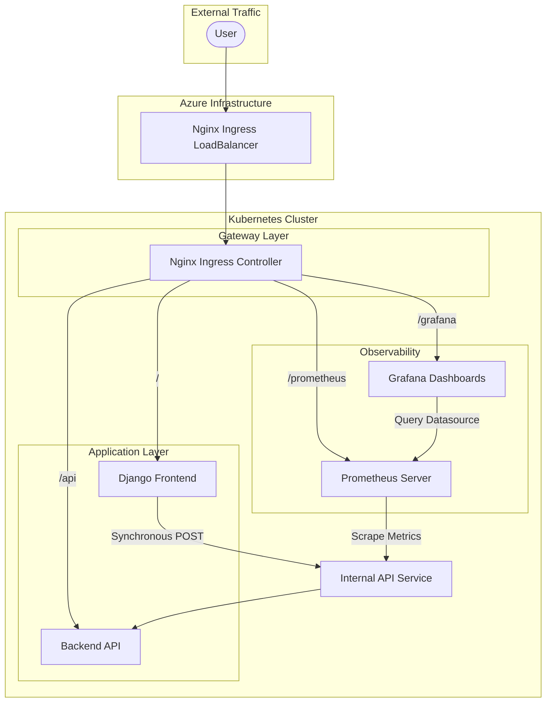

# Service Architecture & Workflow

This document details the architecture and request flow of the Heart Disease Prediction System, optimized for Azure cloud hosting.

## Architecture Diagram

The system utilizes an Nginx Ingress Controller as a unified gateway to manage traffic across all services using a single Public IP.

## Service Communication Details

### 1. Unified Access (Ingress)
All external requests are handled by the **Nginx Ingress Controller**. This architectural choice provides:
- **Cost Efficiency**: Uses only one Azure Public IP.
- **Simplified SSL/TLS**: A centralized place to handle security.
- **Path-Based Routing**: Clean URLs for all tools under a single domain.

### 2. Implementation Overview
- **Routing**: Traffic is routed based on the URL path (`/`, `/api`, `/grafana`, `/prometheus`).
- **Isolation**: Each component runs in separate pods, ensuring that a failure in one (e.g., monitoring) does not affect the prediction engine.
- **Internal Optimization**: Communication between the Frontend and Backend stays within the cluster's internal network (ClusterIP), providing zero-latency overhead.

### 3. Monitoring Workflow
- **Metrics Collection**: Prometheus automatically scrapes telemetry from the FastAPI pods.
- **Visualization**: Grafana queries Prometheus and displays real-time health data (RPS, Latency) on a pre-configured "Heart Disease API" dashboard.
- **Access**: Both tools are accessible at the `/prometheus` and `/grafana` endpoints respectively.
